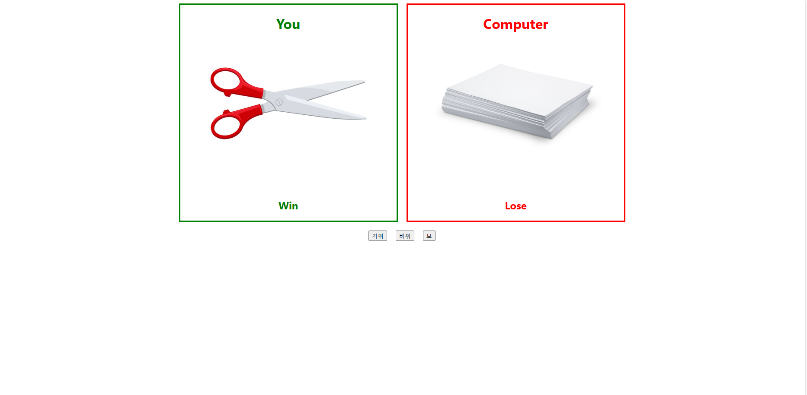

# 리드미

---

# 가위바위보

---



리액트의 기본적인 기능(useState, Props, component 등등…)을 활용하여 컴퓨터와 함께하는 가위바위보 게임을 구현하였습니다.

# 프로젝트 소개

---

1. 사용자는 가위, 바위, 보 세가지 옵션을 선택 할 수 있으며, 이미지가 선택에 따라 바뀝니다.
2. 사용자가 옵션을 선택하면, 컴퓨터도 세가지 옵션 중 랜덤으로 하나를 선택하여 이미지를 보여줍니다.
3. 사용자와 컴퓨터 박스에서 각각 다르게 결과를 알려주며(Win, Lose, Tie) 승패의 결과에 따라서 박스의 색이 변하게 됩니다.

# 시작 가이드

---

```jsx
$ npm install
$ npm start
```
